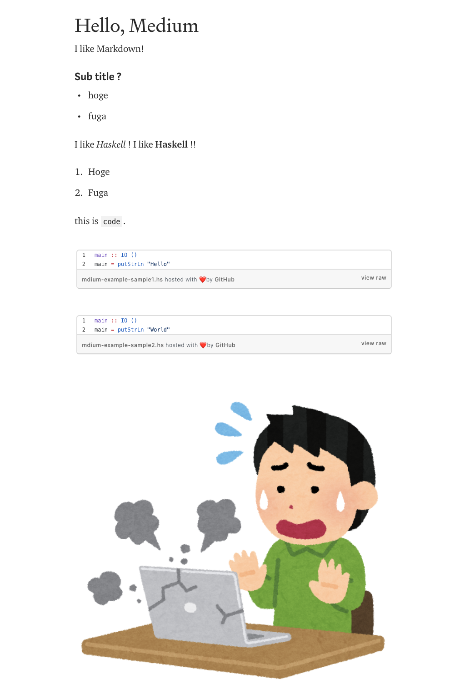

# mdium

## Requirement

- [Haskell Stack](https://docs.haskellstack.org/en/stable/README/) or Docker
- Medium integration token
    - you can generate in [medium settigns](https://medium.com/me/settings).

## Install

Clone this repository:

```
$ git clone https://github.com/matsubara0507/mdium.git
$ cd mdium
```

Install with stack tool:

```
$ stack install mdium
```

### Install with Docker

Use https://github.com/users/matsubara0507/packages/container/mdium

```
$ docker pull ghcr.io/matsubara0507/mdium
```

Use command:

```
$ docker run --rm --env-file="$HOME/.env" -v `pwd`:/work -w /work ghcr.io/matsubara0507/mdium example/example.md
```

## Usage

```
$ mdium --help
mdium [options] [input-file]
      --help                Show this help text
      --version             Show version
  -v  --verbose             Enable verbose mode: verbosity level "debug"
      --me                  Call Medium `me` API
      --title=TEXT          Specify title of story that post to medium
      --org=PUBLICATION_ID  Post story to PUBLICATION_ID organization
      --publications        Call Medium `publications` API
      --gist=TEXT           Replace code block to gist link, TEXT is prefix for gist file name
```

Set Medium integration token to `MEDIUM_TOKEN` environment (use `./.env` or `~/.env`).
Can check to validate your token by executing `medium --me` command:

```
$ mdium --me
Hi MATSUBARA Nobutada!!
```

If post [`examle/example.md`](example/example.md) to Medium:

```
$ mdium --gist=mdium-example- ./example/examle.md
post success, browse to: https://medium.com/@nobutada/f40bd8e72f3e
```

then generate story like below in Medium:



## For Development

### Build with Docker

```
$ stack --docker --local-bin-path=./bin install
$ docker build -t matsubara0507/mdium . --build-arg local_bin_path=./bin
```
